  

  <strong>Desenvolvimento web &nbsp;·&nbsp; Software &nbsp;·&nbsp; Automação</strong>

Tenho interesse em construir aplicações, explorar diferentes linguagens e entender como os sistemas funcionam — da interface ao ambiente de execução. Este espaço reúne meus projetos, estudos e experimentos em desenvolvimento de software.

### Tecnologias

**Web**

  

HTML · CSS · JavaScript · TypeScript

**Linguagens e execução**

  

Python · PHP · Node.js · Java · C# · C

**Ambiente e ferramentas**

  

Docker · Linux · Git · GitHub · Visual Studio Code

### GitHub Stats

  

  

### Áreas de interesse

| Área | O que quero explorar |
| :--- | :--- |
| Desenvolvimento web | Interfaces responsivas, aplicações e integração entre front-end e back-end. |
| Back-end | APIs, lógica de aplicação e organização de serviços. |
| Automação | Scripts e ferramentas para simplificar tarefas repetitivas. |
| Sistemas e ambiente | Linux, containers e configuração de ambientes de desenvolvimento. |

### Princípios de desenvolvimento

Busco evoluir na escrita de código legível, na organização dos projetos e na documentação das decisões. Também tenho interesse em testes e versionamento para tornar o desenvolvimento mais consistente e facilitar a manutenção.

### Projetos e código

Os trabalhos disponíveis para consulta ficam nos meus repositórios públicos. Este perfil será atualizado conforme novos projetos forem publicados.

[**Explorar repositórios →**](https://github.com/Migas08?tab=repositories)

---

  Miguel Vinhado &nbsp;·&nbsp; <a href="https://github.com/Migas08">@Migas08</a>

